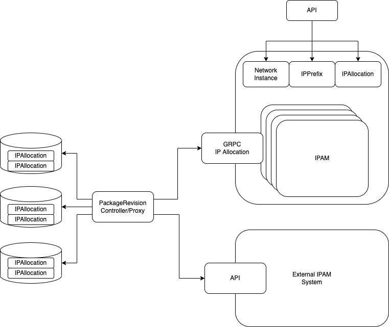
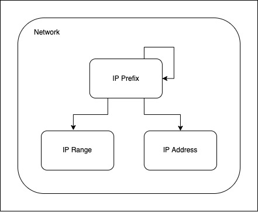

[](https://goreportcard.com/report/github.com/henderiw-nephio/ipam)


---
# A Native Kubernetes IPAM

The IPAM is a kubernetes native IP address management, which supports:
- virtual networks to allow for overlapping IP(s)
- IP addresses, IP prefixes, IP pools and IP ranges within a virtual network
- A k8s api using CRD(s) for configuring and allocating IP addresses within a virtual network
- A GRPC API for allocating and deallocating IP addresses/prefixes/pools
- labels as selectors for IP address allocation or to provide metadata to the ipam resource
- IPv6 and IPv4 in single stack or dual stack mode



## ipam logic and terminology

The IPAM has multiple network contexts (implemented as network-instances) that can have multiple prefixes that can be nested. The top prefix of a nested hierarchy is called an aggregated prefix. At the bottom layer we can have IP ranges or IP addresses that are allocated from within a prefix.



Prefix - A subnet defined within an aggregate prefix. Prefixes extend the hierarchy by nesting within one another. (For example, 2000:1:1::/64 will appear within 2000:1::/48.) 

IP Range - An arbitrary range of individual IP addresses within a prefix, all sharing the same mask. (out of scope for now)

IP Address - An individual IP address along with its subnet mask, automatically arranged beneath its parent prefix.

The actual IPPrefix CRD does not distinguish between an address or a prefix, since an address is a special case of a prefix. An address has a /128 or /32 for ipv6, ipv4 resp.

### ipam use cases

Everything in the IPAM is modelled as an IP Prefix. An IP address is a specific implementation of an IP prefix, meaning is is resp /32 or /128 for ipv4 and ipv6. Besides the IP address There are various use cases for an IP Prefix, like interface based IP(s), loopback based IPs and IP pools/ranges. In order to allow for flexibility a prefix kind is introduced and hence an ip prefix can have various kinds:

- Aggregate: 
  - IP Prefixes are naturally hierarchical and are typically drawn from a specific space that someone operates with. An aggregate prefix-kind can be seen as the top level when nesting IP prefixes. E.g. if an operator got a IP prefix assigned from the RIR it would be implemented as an aggergate. 
  - An aggregate can be nested. E.g. if someone wants to subdivide an address space they can define multiple aggregates where multiple teams operate with.
  - Children of an aggregate IP prefix can be of kind: network, pool and loopback
  - Parents of an aggregate IP prefix can be of kind: aggregate
- network: 
  - IP prefixes that are assigned on (virtual/physical) interfaces of a application would be modelled as a prefix kind network. IP prefixes of this kind can have a mesh relationship between them. E.g. a LAN environment can have multiple routers and hosts that all are in the same subnet.
  - Children of a network IP prefix can be of kind: network
  - Parents of a network IP prefix can be of kind: aggregate
- pool:
  - IP prefixes can also be assigned to pools. E.g. a pool for a DHCP server, a pool for NAT, a pool for allocating IP adddresses to users. The IP prefix of kind pool allows for this use case
  - Children of a pool IP prefix can be of kind: pool
  - Parents of a pool IP prefix can be of kind: aggregate or pool
- loopback
  - IP prefixes can also be assigned to a loopback interface in the application. E.g. a socket for a RADIUS server, Diameter, HTTP srever. The IP prefix of kind loopback allows for this use case
  - Children of a loopback IP prefix can be of kind: loopback
  - Parents of a loopback IP prefix can be of kind: aggregate 

## Injector

Besides the base IPAM block there is also a injector functions which looks at IP Allocations within a GitRepo/package revision and allocates/deallocates IP(s) using a GRPC interface. This is a pluggable system which allows to interact with 3rd party IPAM systems.

## use cases

### run IPAM

```
make run
```

### run IPAM using kpt

```
kpt live init blueprint/ipam
kpt live apply blueprint/ipam
```

### Setup IPAM

To steup the IPAM, one needs to configure a virtual network, implemented through a network-instance

```
cat <<EOF | kubectl apply -f -
apiVersion: ipam.nephio.org/v1alpha1
kind: NetworkInstance
metadata:
  name: vpc-1
spec:
EOF
```

The next step is to create a prefix from which ip addresses can be allocated.

A network prefix example with a gateway.

```
cat <<EOF | kubectl apply -f -
apiVersion: ipam.nephio.org/v1alpha1
kind: IPPrefix
metadata:
  name: net1-prefix1
  labels:
    nephio.org/gateway: "true"
spec:
  prefix: 10.0.1.1/24
  network: net1
  networkInstance: vpc-1
EOF
```

An aggregated prefix example

```
cat <<EOF | kubectl apply -f -
apiVersion: ipam.nephio.org/v1alpha1
kind: IPPrefix
metadata:
  name: aggregate0
spec:
  kind: aggregate
  prefix: 10.0.0.0/8
  networkInstance: vpc-1
EOF
```

To verify the status in the system we can use the following command

```
kubectl get ipam
```

The output will look like this

```
NAME                                    SYNC   STATUS   NETWORK   KIND        NETWORK   PREFIX-REQ    PREFIX-ALLOC   AGE
ipprefix.ipam.nephio.org/aggregate0     True   True     vpc-1     aggregate             10.0.0.0/8    10.0.0.0/8     5s
ipprefix.ipam.nephio.org/net1-prefix1   True   True     vpc-1     network     net1      10.0.1.1/24   10.0.1.1/24    75s

NAME                                    SYNC   STATUS   AGE
networkinstance.ipam.nephio.org/vpc-1   True   True     2m44s
```

To view the IPAM IP allocation we can look at the allocations under the network-instance

```
kubectl describe  networkinstances.ipam.nephio.org network-1
```

The output will look like this

```
k describe networkinstances.ipam.nephio.org network-1
Name:         vpc-1
Namespace:    default
API Version:  ipam.nephio.org/v1alpha1
Kind:         NetworkInstance

....

Status:
  Allocations:
    10.0.0.0/8:
      nephio.org/address-family:    ipv4
      nephio.org/allocation-name:   aggregate0
      nephio.org/network-instance:  vpc-1
      nephio.org/origin:            prefix
      nephio.org/prefix-kind:       aggregate
      nephio.org/prefix-length:     8
      nephio.org/prefix-name:       aggregate0
    10.0.1.0/24:
      nephio.org/address-family:    ipv4
      nephio.org/allocation-name:   10.0.1.0-24
      nephio.org/network:           10.0.1.0
      nephio.org/network-instance:  vpc-1
      nephio.org/network-name:      net1
      nephio.org/origin:            system
      nephio.org/prefix-kind:       network
      nephio.org/prefix-length:     24
      nephio.org/prefix-name:       net
    10.0.1.0/32:
      nephio.org/address-family:        ipv4
      nephio.org/allocation-name:       10.0.1.0
      nephio.org/network:               10.0.1.0
      nephio.org/network-instance:      vpc-1
      nephio.org/network-name:          net1
      nephio.org/origin:                system
      nephio.org/parent-prefix-length:  24
      nephio.org/prefix-kind:           network
      nephio.org/prefix-length:         32
      nephio.org/prefix-name:           net
    10.0.1.1/32:
      nephio.org/address-family:        ipv4
      nephio.org/allocation-name:       net1-prefix1
      nephio.org/gateway:               true
      nephio.org/network:               10.0.1.0
      nephio.org/network-instance:      vpc-1
      nephio.org/network-name:          net1
      nephio.org/origin:                prefix
      nephio.org/parent-prefix-length:  24
      nephio.org/prefix-kind:           network
      nephio.org/prefix-length:         32
      nephio.org/prefix-name:           net1-prefix1
  Conditions:
    Kind:                  Synced
    Last Transition Time:  2022-11-07T11:01:28Z
    Reason:                ReconcileSuccess
    Status:                True
    Kind:                  Ready
    Last Transition Time:  2022-11-07T11:01:28Z
    Reason:                Ready
    Status:                True
Events:                    <none>
```

### IP address allocation 

To request an IP address from the IPAM system we either use the K8s or the GRPC API.
By providing a network-instance and network-name label-selector an IP address will be allocated
from an IPAM prefix that matches these labels.

```
cat <<EOF | kubectl apply -f -
apiVersion: ipam.nephio.org/v1alpha1
kind: IPAllocation
metadata:
  name: alloc1
spec:
  kind: network
  selector:
    matchLabels:
      nephio.org/network-instance:  vpc-1
      nephio.org/network-name: net1
EOF
```

A prefix and parent prefix is allocated

```
NAME                                  SYNC   STATUS   KIND      AF    PREFIXLENGTH   PREFIX-REQ   PREFIX-ALLOC   GATEWAY    AGE
ipallocation.ipam.nephio.org/alloc1   True   True     network                                     10.0.1.2/32    10.0.1.1   4s
```

### static IP address allocation 

To support static or determinsitic IP allocation a predetermined IP is allocated using the IP Prefix API, that sets a specific label e.g. key: nephio.org/interface value: n3. Any key and value can be used other thna the system defined once

```
cat <<EOF | kubectl apply -f -
apiVersion: ipam.nephio.org/v1alpha1
kind: IPPrefix
metadata:
  name: net1-prefix10
  labels:
    nephio.org/interface: n3
spec:
  prefix: 10.0.1.10/24
  network: net1
  networkInstance: vpc-1
EOF
```

By referencing this label in the label selector we can allocate the IP that was statically allocated

```
cat <<EOF | kubectl apply -f -
apiVersion: ipam.nephio.org/v1alpha1
kind: IPAllocation
metadata:
  name: alloc2-n3
spec:
  kind: network
  selector:
    matchLabels:
      nephio.org/network-instance:  vpc-1
      nephio.org/network-name: net1
      nephio.org/interface: n3
EOF
```

```
NAME                                     SYNC   STATUS   NETWORK   KIND        NETWORK   PREFIX-REQ     PREFIX-ALLOC   AGE
ipprefix.ipam.nephio.org/aggregate0      True   True     vpc-1     aggregate             10.0.0.0/8     10.0.0.0/8     19m
ipprefix.ipam.nephio.org/net1-prefix1    True   True     vpc-1     network     net1      10.0.1.1/24    10.0.1.1/24    21m
ipprefix.ipam.nephio.org/net1-prefix10   True   True     vpc-1     network     net1      10.0.1.10/24   10.0.1.10/24   14m

NAME                                     SYNC   STATUS   KIND      AF    PREFIXLENGTH   PREFIX-REQ   PREFIX-ALLOC   GATEWAY     AGE
ipallocation.ipam.nephio.org/alloc1      True   True     network                                     10.0.1.11/32   10.0.1.0    17m
ipallocation.ipam.nephio.org/alloc2-n3   True   True     network                                     10.0.1.10/32   10.0.1.10   11m
```

### GW IP address allocation

To request the GW IP of the prefix, we use the following mechanism:

- First when creating the IP prefix we create it using the following notation 10.0.0.1/24. As such the .1 is allocated by the IPAM as a gateway IP automatically.

Allocate an IP with the ephio.org/gateway: "true" label in the label selector

```
cat <<EOF | kubectl apply -f -
apiVersion: ipam.nephio.org/v1alpha1
kind: IPPrefix
metadata:
  name: net1-prefix1
  labels:
    nephio.org/gateway: "true"
spec:
  prefix: 10.0.1.1/24
  network: net1
  networkInstance: vpc-1
EOF
```

Now also the GW IP will be referenced

```
kubectl get ipam
```

```
NAME                                     SYNC   STATUS   NETWORK   KIND        NETWORK   PREFIX-REQ     PREFIX-ALLOC   AGE
ipprefix.ipam.nephio.org/aggregate0      True   True     vpc-1     aggregate             10.0.0.0/8     10.0.0.0/8     19m
ipprefix.ipam.nephio.org/net1-prefix1    True   True     vpc-1     network     net1      10.0.1.1/24    10.0.1.1/24    21m
ipprefix.ipam.nephio.org/net1-prefix10   True   True     vpc-1     network     net1      10.0.1.10/24   10.0.1.10/24   14m

NAME                                     SYNC   STATUS   KIND      AF    PREFIXLENGTH   PREFIX-REQ   PREFIX-ALLOC   GATEWAY     AGE
ipallocation.ipam.nephio.org/alloc1      True   True     network                                     10.0.1.11/32   10.0.1.0    17m
ipallocation.ipam.nephio.org/alloc2-n3   True   True     network                                     10.0.1.10/32   10.0.1.10   11m
```

### pool allocation

To allocate a pool we speific the prefix length and the network-instance that should match

```
cat <<EOF | kubectl apply -f -
apiVersion: ipam.nephio.org/v1alpha1
kind: IPAllocation
metadata:
  name: alloc-pool1
spec:
  kind: pool
  prefixLength: 16
  selector:
    matchLabels:
      nephio.org/network-instance:  vpc-1
EOF
```

```
kubectl get get ipallocations.ipam.nephio.org
```

```
NAME                                       SYNC   STATUS   KIND      AF    PREFIXLENGTH   PREFIX-REQ   PREFIX-ALLOC   GATEWAY     AGE
ipallocation.ipam.nephio.org/alloc-pool1   True   True     pool            16                          10.1.0.0/16                4s
```
## License

Copyright 2022 nokia.

Licensed under the Apache License, Version 2.0 (the "License");
you may not use this file except in compliance with the License.
You may obtain a copy of the License at

    http://www.apache.org/licenses/LICENSE-2.0

Unless required by applicable law or agreed to in writing, software
distributed under the License is distributed on an "AS IS" BASIS,
WITHOUT WARRANTIES OR CONDITIONS OF ANY KIND, either express or implied.
See the License for the specific language governing permissions and
limitations under the License.

